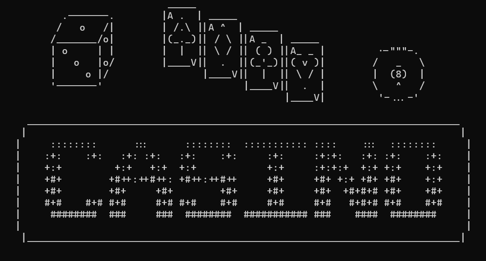
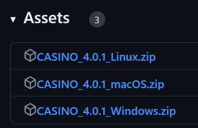
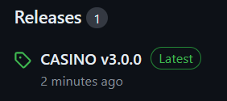
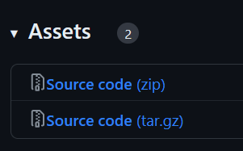
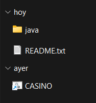

<p align="center">

</p>

<p align="center">
Casino interactivo en Java para terminal
</p>
<p align="center">
 <a href=""></a>&nbsp;
 <a href=""></a>&nbsp;
 <a href=""></a>
</p>

## Casino

Este juego simula un casino con varios juegos. Todo esta programado en Java y se usa mediante terminal (Windows, Linux y Mac). 

Actualmente el proyecto dispone de los siguientes juegos:

 - Dados
 - Ruleta
 - Bingo (vs CPU)
 - Blackjack

## Descarga

### Paquetes descargables

A partir de la v4.0.0, se han implementado paquetes descargables para diferentes sistemas operativos.



Seleccionamos la version para nuestro sistema operativo y la descomprimimos.

### Descargar _source code_:

#### Usando _git_

```term
git clone https://github.com/paualdea/CASINO.git
```

#### Descargar directamente:



Seleccionaremos la versión que queramos descargar (apartado _Releases_).



Escogemos el paquete que queramos (_zip_ o _tar.gz_) y los descomprimimos en nuestro sistema.

## Uso

### Windows



Una vez descomprimido el paquete descargable, basta con ejecutar el _launcher_ _.bat_ que tenemos en la raíz de la carpeta.

### Linux


## Funcionamiento

En cada paquete descargable, hay un script que ejecuta un fichero _.jar_ que hemos creado en base al proyecto programado aquí. Este contiene varios paquetes y classes que permiten la ejecución de todos los juegos.

Además, implementa un sistema de ficheros con el que almacenamos los usuarios creados y sus respectivos puntos.
