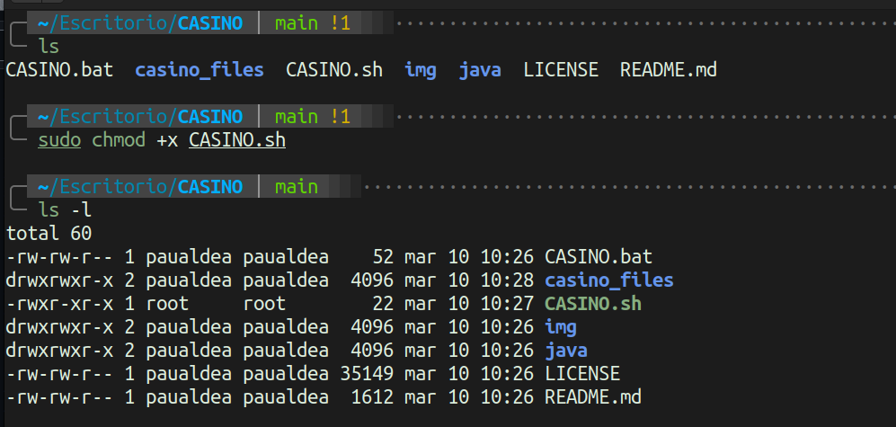

<p align="center">

</p>

<p align="center">
Casino interactivo en Java para terminal
</p>
<p align="center">
 <a href=""></a>&nbsp;
 <a href=""></a>&nbsp;
 <a href=""></a>
</p>

## Casino

Este juego simula un casino con varios juegos. Todo esta programado en Java y se usa mediante terminal (Windows, Linux y Mac). 

Actualmente el proyecto dispone de los siguientes juegos:

 - Dados
 - Ruleta
 - Bingo (vs CPU)
 - Blackjack

## Descarga

### Descargar con `git`:

```term
git clone https://github.com/paualdea/CASINO.git
```

### Descargar directamente:


Seleccionaremos la versión que queramos descargar (apartado _Releases_).


Escogemos el paquete que queramos (_zip_ o _tar.gz_) y los descomprimimos en nuestro sistema.

## Uso

### Windows

Es muy importante que para usar este programa ejecutes el fichero `CASINO.bat` para que pueda cargar todo correctamente. No solo sirve para permitir la visualización de los palos de las cartas, sino que también para poder hacer funcionar el sistema de ficheros que hemos implementado a partir de la versión 3.0.0.

### Linux

En el caso de Linux, una vez tenemos el fichero _.zip_ descomprimido, le daremos permisos de ejecución al launcher del casino.



Una vez tengamos permisos de ejecución, podemos ejecutarlo con el siguiente comando:

```term
./CASINO.sh
```

## Funcionamiento

El fichero `CASINO.java` crea una carpeta y un fichero para guardar los usuarios y puntos que vayamos usando durante la ejecución del juego. Una vez registrado y logueado, podrás acceder al menú de los juegos en dónde podras tantas veces cómo quieras hasta que te quedes sin puntos o decidas salir.

