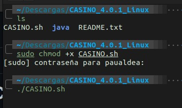

<p align="center">

</p>

<p align="center">
CASINO programado en Java
</p>
<p align="center">
 <a href=""></a> 
 <a href=""></a> 
</p>

## Casino

Casino programado en Java. Se ejecuta mediante terminal (Windows, Linux y Mac). 

Actualmente, el proyecto dispone de los siguientes juegos:

- Dados
- Ruleta
- Bingo (vs CPU)
- Blackjack

## Descarga

### Paquetes descargables

A partir de la v4.0.0, se han implementado paquetes descargables para diferentes sistemas operativos.


Seleccionamos la version para nuestro sistema operativo y la descomprimimos.

### Descargar _source code_:

#### Usando _git_

```term
git clone https://github.com/paualdea/CASINO.git
```

#### Descargar directamente:


Seleccionaremos la versión que queramos descargar (apartado _Releases_).


Escogemos el paquete que queramos (_zip_ o _tar.gz_) y los descomprimimos en nuestro sistema.

## Uso

### Windows


Una vez descomprimido el paquete descargable, debemos ejecutar el _script_ _.bat_ que hay en la raíz de la carpeta.

### Linux



En Linux, una vez descomprimido el paquete descargable, debemos darle permisos al _script_ que actua cómo _launcher_ y posteriormente ejecutarlo `./CASINO.sh`.

## Funcionamiento

El Casino está programado usando una estructura de paquetes y clases que hacen del código algo más intuitivo y legible. Para los juegos, hemos creado el paquete _juegos_ en dónde tenemos las 4 clases de los juegos que tenemos.

Luego, compilamos todo este código para convertir el proyecto en un fichero _.jar_.

Por último, en los paquetes descargables, implementamos un script (que varía dependiendo del SO) en el que adaptamos la ventana del terminal y ejecutamos el juego para que su visualización sea óptima.

Además, a partir de la versión `5.0.0`, administramos los datos usando el SGBD SQLite, que permite almacenar los datos usando una base de datos en lugar de usar simples ficheros de texto almacenados.
