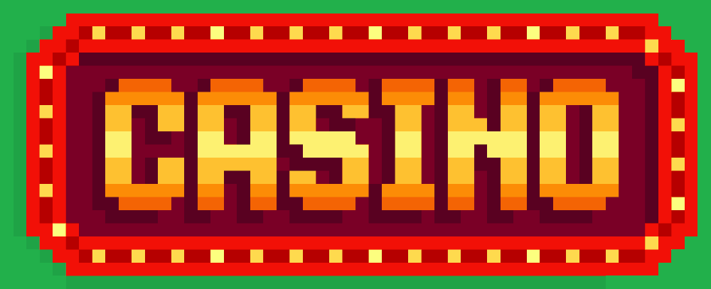

<p align="center">

</p>

<p align="center">
CASINO programado en Java
</p>
<p align="center">
 <a href=""></a> 
 <a href=""></a> 
 <a href=""></a>
</p>

## Descripción

Casino programado en Java. A partir de la version `6.0.0` el juego del Casino se abre en una GUI usando JavaFX.

Actualmente, el proyecto dispone de los siguientes juegos:

- Dados
- Ruleta
- Bingo (vs CPU)
- Blackjack

## Descarga

### Paquetes descargables

A partir de la v4.0.0, se han implementado paquetes descargables para diferentes sistemas operativos.


Seleccionamos la version para nuestro sistema operativo y la descomprimimos.


### Descargar _source code_:

#### Usando _git_

```term
git clone https://github.com/paualdea/CASINO.git
```

#### Descargar directamente:


Seleccionaremos la versión que queramos descargar (apartado _Releases_).


Escogemos el paquete que queramos (_zip_ o _tar.gz_) y los descomprimimos en nuestro sistema.
